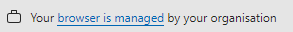

# Override Homepage Chrome Extension

The "Override Homepage" Chrome extension is a simple tool that helps you take control of your browser's startup pages.
Really, you don't need it unless you work in a company that opens up intranet pages you don't want to see.
